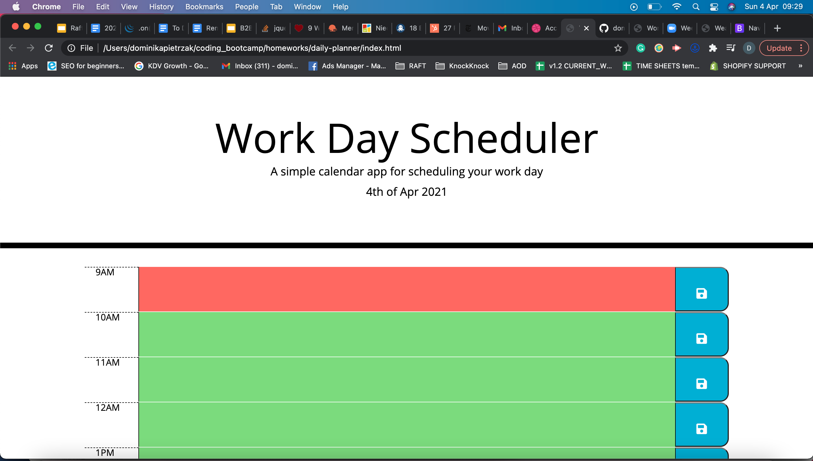
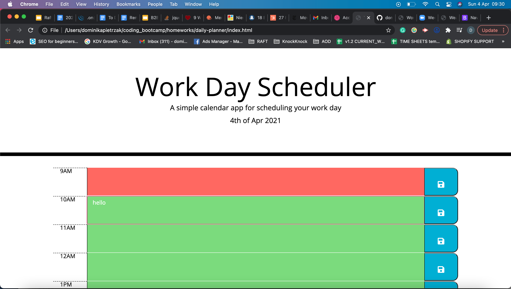

# Daily Planner

## Project Link

You can view this project on GitHub pages by clicking [here](https://dominikacookies.github.io/daily-planner/).

## Description

This project is a daily planner which allows the user to plan their day by saving event information in the relevant time block. The planner also makes it easy for the user to see which events have passed and which are upcoming based the colour of the time block.

### Key functionalities
- displays the current day to the user
- presents user with time blocks for office hours
- time blocks accept event information from the user and display it following saving of the event
- time blocks inherit a different colour depending on whether the time is present, passed, or future 
- allows user to update their event information and destroys old information

## Screenshots of App

### Load screen
 

### User inputting event information

### Saved event information is loaded onto the screen

## Video of App
You can view the app in action [here](./assets/screenshots/appInUse.mov).
